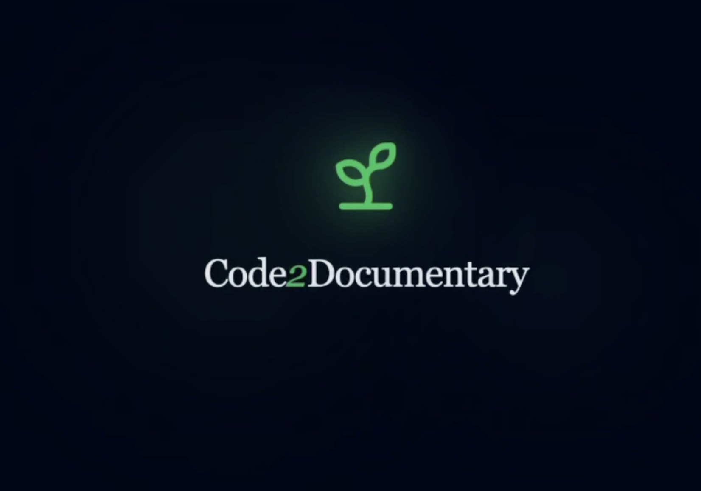

<div align="center">
  
  
  
  # 🎬 Code-to-Documentary
  
  ### *Transform Your Codebase into a Thrilling Audio Experience*
  
  [](https://reactjs.org/)
  [](https://deepmind.google/technologies/gemini/)
  [](https://www.typescriptlang.org/)
  [](https://vitejs.dev/)
  
  [🚀 Live Demo](#) • [📹 Video Demo](#) • [🐛 Report Bug](../../issues) • [✨ Request Feature](../../issues)
  
</div>

---

## 📖 Table of Contents

- [✨ About The Project](#-about-the-project)
- [🎯 Features](#-features)
- [🎭 Narrative Styles](#-narrative-styles)
- [🎙️ Voice Options](#️-voice-options)
- [🛠️ Built With](#️-built-with)
- [🚀 Getting Started](#-getting-started)
- [📸 Screenshots](#-screenshots)
- [🎮 How to Use](#-how-to-use)
- [🏆 CodeCraze Hackathon](#-codecraze-hackathon)
- [🔮 Future Enhancements](#-future-enhancements)
- [🤝 Contributing](#-contributing)
- [📜 License](#-license)
- [👥 Team](#-team)

---

## ✨ About The Project

> *"Here we see the `AuthMiddleware` in its natural habitat, carefully guarding the routes from unauthorized predators..."*

**Code-to-Documentary** is an innovative web application that turns your static, lifeless codebase into an engaging, professionally narrated audio documentary. Using the power of **Google's Gemini 3 Pro** AI with its massive 2M token context window, we analyze your entire project structure and generate entertaining commentary in various narrative styles.

### 🎯 Why This Project?

- **🎓 Educational**: Learn about your codebase through entertaining narratives
- **😄 Entertainment**: Get roasted by a grumpy senior dev or hyped by a tech evangelist
- **🔍 Code Review**: Discover insights about your code architecture in a fun way
- **🎨 Creative AI**: Showcases advanced AI capabilities in a unique use case

---

## 🎯 Features

<table>
<tr>
<td width="50%">

### 🧠 Deep Code Analysis
Uses Gemini 3 Pro's massive context window to read your **entire project structure** from a `.zip` file in one go.

</td>
<td width="50%">

### 🎭 5 Unique Narrative Styles
From David Attenborough nature docs to film noir detective stories.

</td>
</tr>
<tr>
<td>

### 🎙️ Neural Text-to-Speech
High-quality audio synthesis using `gemini-2.5-flash-preview-tts` with 5 different voice options.

</td>
<td>

### 🤖 Emotional AI Avatar
Animated narrator with expressions that change based on style and simulated lip-sync.

</td>
</tr>
<tr>
<td>

### 📊 Code Metrics
Get insights with fun stats:
- 🍝 **Spaghetti Index**
- ⚡ **Modernity Score**  
- 💸 **Tech Debt Level**

</td>
<td>

### 🎨 Customizable Visualizer
Switch between Bars/Waves visualization and multiple color themes.

</td>
</tr>
</table>

---

## 🎭 Narrative Styles

<details open>
<summary><b>🌿 Nature Documentary (Attenborough Style)</b></summary>

> *"In the vast ecosystem of React components, we observe the parent component carefully passing props to its offspring, a delicate dance of data flow that has evolved over millions of commits..."*

Perfect for: Dramatic, insightful, and humorous observations about your code's "natural behavior"

</details>

<details>
<summary><b>☕ Senior Dev (Cynical Code Review)</b></summary>

> *"Oh look, another nested ternary. Fantastic. Because what this codebase really needed was more eye strain. Back in my day, we used if-else statements like civilized developers..."*

Perfect for: Harsh reality checks and sarcastic commentary on code quality

</details>

<details>
<summary><b>⚡ Tech Evangelist (Silicon Valley Hype)</b></summary>

> *"This is absolutely GAME-CHANGING! This util function? Pure innovation! We're talking paradigm-shifting, cloud-native, AI-powered excellence that's going to DISRUPT the entire industry!"*

Perfect for: Over-the-top enthusiasm about even the most mundane code

</details>

<details>
<summary><b>🕵️ Noir Detective (Gritty Mystery)</b></summary>

> *"It was a dark and stormy night in App.tsx. The function didn't smell right. Too many parameters, not enough return. I knew something was wrong the moment I saw that variable... it had a shifting type..."*

Perfect for: Moody, mysterious narration treating bugs as crime scenes

</details>

<details>
<summary><b>⚔️ Epic Fantasy (Dungeons & Dragons)</b></summary>

> *"Lo and behold! The ancient scroll of package.json reveals the summoned artifacts! The wizard-developer has conjured forth the sacred dependencies from the mystical NPM registry!"*

Perfect for: Grandiose storytelling where functions are spells and bugs are dragons

</details>

---

## 🎙️ Voice Options

| Voice Name | Characteristics | Best For |
|------------|----------------|----------|
| **Fenrir** | Deep, dramatic, authoritative | Nature Doc, Fantasy |
| **Zephyr** | Calm, soothing, professional | Senior Dev, Noir |
| **Puck** | Energetic, playful, upbeat | Tech Evangelist |
| **Charon** | Dark, mysterious, resonant | Noir Detective |
| **Kore** | Warm, balanced, versatile | All styles |

---

## 🛠️ Built With

### Core Technologies
- **[React 19](https://react.dev/)** - UI framework with latest features
- **[TypeScript](https://www.typescriptlang.org/)** - Type-safe development
- **[Vite](https://vitejs.dev/)** - Lightning-fast build tool
- **[Tailwind CSS](https://tailwindcss.com/)** - Utility-first styling

### AI & Services
- **[Google Gemini 3 Pro](https://deepmind.google/technologies/gemini/)** - Advanced text generation with 2M token context
- **[Gemini 2.5 Flash TTS](https://ai.google.dev/)** - Neural text-to-speech synthesis
- **[@google/genai](https://www.npmjs.com/package/@google/genai)** - Official Google Generative AI SDK

### Utilities
- **[JSZip](https://stulzq.github.io/jszip/)** - Client-side ZIP file extraction
- **[Lucide React](https://lucide.dev/)** - Beautiful icon library

---

## 🚀 Getting Started

### Prerequisites

- **Node.js** (v18 or higher)
- **npm** or **yarn**
- **Google AI API Key** ([Get one here](https://makersuite.google.com/app/apikey))

### Installation

1. **Clone the repository**
   ```bash
   git clone https://github.com/ABHIJATSARARI/code-to-documentary.git
   cd code-to-documentary
   ```

2. **Install dependencies**
   ```bash
   npm install
   # or
   yarn install
   ```

3. **Set up environment variables**
   
   Create a `.env.local` file in the root directory:
   ```env
   API_KEY=your_google_ai_api_key_here
   ```

4. **Start the development server**
   ```bash
   npm run dev
   # or
   yarn dev
   ```

5. **Open your browser**
   
   Navigate to `http://localhost:5173`

### Building for Production

```bash
npm run build
npm run preview
```

---


</div>

---

## 🎮 How to Use

### Step-by-Step Guide

1. **🎭 Select Narrative Style**
   - Choose from 5 unique personas (Nature Doc, Senior Dev, Tech Evangelist, Noir Detective, Epic Fantasy)

2. **🎙️ Pick Your Voice**
   - Select from 5 different AI voices (Fenrir, Zephyr, Puck, Charon, Kore)

3. **📦 Prepare Your Code**
   - Zip your project folder (include all source files)
   - Recommended: Focus on key directories (src, components, services, etc.)

4. **📤 Upload**
   - Drag and drop your `.zip` file into the upload zone
   - Or click to browse and select

5. **⏳ Wait for Magic**
   - The app extracts your code
   - Gemini 3 Pro analyzes the structure
   - AI generates the script and metrics
   - Text-to-speech creates the audio

6. **🎧 Enjoy!**
   - Listen to your code being narrated
   - Watch the avatar react
   - View the audio visualizer
   - Check out your code metrics

### 💡 Pro Tips

- **Smaller zips process faster** - Focus on core source files
- **Try different styles** for different perspectives on the same code
- **Mix and match** voices with styles for unique combinations
- **Share the audio** with your team for fun code reviews

---

## 🏆 CodeCraze Hackathon

<div align="center">
  
### 🎉 Built for CodeCraze - The Ultimate Open Innovation Hackathon

**Prize Pool: $5,000**

</div>

#### 🌟 About CodeCraze

CodeCraze is the ultimate open-innovation hackathon where creativity meets technology. With **no fixed themes** and **no restrictions**, participants have complete freedom to build anything they're passionate about.

#### 💰 Prize Distribution

| 🏅 Position | 💵 Prize | Description |
|------------|---------|-------------|
| 🥇 **Winner** | **$2,500** | Best overall project |
| 🥈 **1st Runner Up** | **$1,500** | Outstanding innovation |
| 🥉 **2nd Runner Up** | **$1,000** | Impressive execution |

#### ⚖️ Judging Criteria

This project was built with these criteria in mind:

- ✨ **Uniqueness of Idea** - Novel approach to code analysis and presentation
- 🌍 **Real World Impact** - Educational value and entertainment for developers
- 🔧 **Technologies Used** - Leveraging cutting-edge AI (Gemini 3 Pro) and modern web stack

#### 🎯 Why This Project Stands Out

1. **🚀 Innovative AI Application** - Creative use of Gemini's massive context window
2. **🎨 Unique Value Prop** - No other tool makes code this entertaining
3. **💡 Technical Excellence** - Advanced prompt engineering, TTS integration, real-time processing
4. **🌐 Practical Use Case** - Makes code reviews fun and educational
5. **🎭 Creative Execution** - 5 distinct personas showcase AI versatility

---

## 🔮 Future Enhancements

<details>
<summary>Click to see our roadmap</summary>

### Version 2.0 Planned Features

- [ ] **🌐 Multi-language Support** - Support for more programming languages
- [ ] **💾 Save & Share** - Export audio files and share via links
- [ ] **📊 Enhanced Analytics** - More detailed code metrics and visualizations
- [ ] **🎨 Custom Styles** - Allow users to create their own narrative styles
- [ ] **👥 Team Mode** - Collaborative code reviews with multiple narrators
- [ ] **🔗 GitHub Integration** - Direct repository import without zipping
- [ ] **📱 Mobile App** - Native iOS/Android applications
- [ ] **🎬 Video Export** - Generate video with code snippets highlighted
- [ ] **🤖 AI Chat** - Ask questions about your codebase to the narrator
- [ ] **📈 Historical Tracking** - Track code metrics over time

</details>

---

## 🤝 Contributing

Contributions are what make the open source community amazing! Any contributions you make are **greatly appreciated**.

### How to Contribute

1. Fork the Project
2. Create your Feature Branch (`git checkout -b feature/AmazingFeature`)
3. Commit your Changes (`git commit -m 'Add some AmazingFeature'`)
4. Push to the Branch (`git push origin feature/AmazingFeature`)
5. Open a Pull Request

### Development Guidelines

- Follow the existing code style
- Write meaningful commit messages
- Add comments for complex logic
- Test your changes thoroughly
- Update documentation as needed

---

## 📜 License

This project is open source and available under the [MIT License](LICENSE).

---

## 👥 Team

<div align="center">

**Built with ❤️ for CodeCraze Hackathon**

<table>
<tr>
<td align="center">
<br />
<sub><b>ABHIJAT SARARI</b></sub><br />
<a href="https://github.com/ABHIJATSARARI">GitHub</a> • <a href="https://twitter.com/ABHIJATSARARI">Twitter</a>
</td>
<!-- Add more team members here -->
</tr>
</table>

</div>

---

<div align="center">

### 🌟 If you found this project interesting, please give it a star!

### 📬 Questions? Feedback? Reach out!

[Report a Bug](../../issues) • [Request a Feature](../../issues) • [Discussions](../../discussions)

---

**Made with 🎬 by developers, for developers**

*"In the vast savanna of open source, every star helps us survive..." - Attenborough, probably*

</div>
